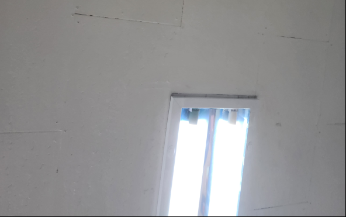
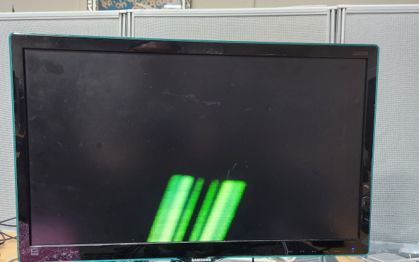

# NexEBAZ4205_OV5640_PS

EBAZ4205 + hellofpga IO board + OV5640 camera → Zynq PS DDR3 frame buffer → HDMI output

- OV5640 DVP 1280x720 RGB565 → AXI HP → PS DDR3 frame buffer → AXI HP → 1280x720 HDMI 풀해상도 출력
- Zynq PS bare metal (FSBL + standalone)
- PL: OV5640 capture + AXI master (write) + display timing + rgb2dvi (read)
- Vivado project: `vivado -mode batch -source vivado/build.tcl`

베이스: [NexEBAZ4205_OV5640_PL](https://github.com/nexfieldsolution/NexEBAZ4205_OV5640_PL) — PL only 버전에서 PS 통합으로 확장

## 작업 결과

- 320×240 영상 출력 OK (DDR3 프레임버퍼 → HDMI)
- AXI HP0 write / HP1 read 파이프라인 동작 확인 (xsdb mrd/mwr 검증)
- 1픽셀 오프셋 버그 수정 (addr_latch 추가, 2026.07.01)

| 기대 결과 | 현재 결과 |
|-----------|-----------|
|  |  |

## 문제점

- **색상 문제 있음** — ps7_init 영향으로 특정 데이터 핀 고착 의심
  - PL 버전은 정상, PS 버전만 색상 이상 → ps7_init이 범인으로 추정
  - ILA로 ov5640_data[7:0] 확인 필요
  - **일단 넘어가기로 함 → 향후 PetaLinux에서 계속 디버깅**

## Status

- [x] Zynq PS Block Design 생성 (PS7 + DDR3 + AXI HP0/HP1)
- [x] top_ov5640_ps.v 완성
- [x] axi_hp0_writer.v — OV5640 → DDR3 write
- [x] axi_hp1_reader.v — DDR3 → display read
- [x] 320×240 영상 출력 동작 확인
- [ ] 색상 문제 해결 (PetaLinux에서 재디버깅 예정)
- [ ] 1280×720 풀해상도 프레임버퍼로 확장
- [ ] PetaLinux 부팅

## Architecture

```
OV5640 DVP (54MHz PCLK)
    ↓
PL: ov5640_capture → AXI HP0 write → DDR3 (1280×720×2 = 1.84MB/frame)
                                           ↓
PL: display timing (1280×720) ← AXI HP1 read
    ↓
rgb2dvi (Digilent) → HDMI
```

## Pin Map

### System

| Signal   | Pin | IOSTANDARD | Description        |
|----------|-----|------------|--------------------|
| CLK      | N18 | LVCMOS33   | 50MHz PL clock     |
| UART_TX  | H17 | LVCMOS33   | UART TX (CH340)    |

### HDMI (hellofpga IO board, TMDS)

| Signal      | Pin | IOSTANDARD | Description     |
|-------------|-----|------------|-----------------|
| HDMI_CLK_P  | F19 | TMDS_33    | TMDS clock +    |
| HDMI_CLK_N  | F20 | TMDS_33    | TMDS clock -    |
| HDMI_P[0]   | D19 | TMDS_33    | TMDS data0 +    |
| HDMI_N[0]   | D20 | TMDS_33    | TMDS data0 -    |
| HDMI_P[1]   | C20 | TMDS_33    | TMDS data1 +    |
| HDMI_N[1]   | B20 | TMDS_33    | TMDS data1 -    |
| HDMI_P[2]   | B19 | TMDS_33    | TMDS data2 +    |
| HDMI_N[2]   | A20 | TMDS_33    | TMDS data2 -    |

### OV5640 (hellofpga IO board 20-pin camera connector)

| Signal          | Pin | IOSTANDARD | Description                          |
|-----------------|-----|------------|--------------------------------------|
| ov5640_pclk     | J18 | LVCMOS33   | Pixel clock (MRCC P-type, 54MHz)     |
| ov5640_vsync    | M17 | LVCMOS33   | Vertical sync                        |
| ov5640_href     | N20 | LVCMOS33   | Horizontal ref                       |
| ov5640_data[0]  | G19 | LVCMOS33   | Pixel data bit 0 (구 PWDN핀 재활용)  |
| ov5640_data[1]  | L16 | LVCMOS33   | Pixel data bit 1                     |
| ov5640_data[2]  | G20 | LVCMOS33   | Pixel data bit 2 (구 RST핀 재활용)   |
| ov5640_data[3]  | L19 | LVCMOS33   | Pixel data bit 3                     |
| ov5640_data[4]  | K18 | LVCMOS33   | Pixel data bit 4 (MRCC N-type 재활용)|
| ov5640_data[5]  | J19 | LVCMOS33   | Pixel data bit 5                     |
| ov5640_data[6]  | K19 | LVCMOS33   | Pixel data bit 6                     |
| ov5640_data[7]  | H20 | LVCMOS33   | Pixel data bit 7                     |
| ov5640_sioc     | P18 | LVCMOS33   | I2C SCL                              |
| ov5640_siod     | M19 | LVCMOS33   | I2C SDA                              |
| ov5640_reset    | J20 | LVCMOS33   | Reset (active low, XADC출력으로 동작)|
| ov5640_pwdn     | L17 | LVCMOS33   | Power down — dummy (카메라 GND 직결) |
